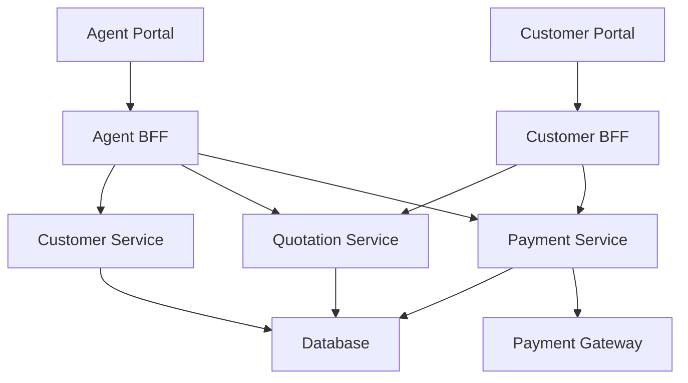

# Challenge 1: Weather Microservice Design

## 1. Executive Summary

The Weather microservice provides RESTful APIs to retrieve, store, and export weather information.

## 2. Assumptions
 
- Weather data is fetched periodically from https://data.gov.sg/ and cached locally to reduce redundant requests.
- Data is stored in a **relational database (SQLite)** for query and export purposes. SQLite was chosen because it does not rely on an external database installation. It is an embedded database that runs directly within the application, storing data in a single local file. This eliminates the need to install, configure, or manage a separate database server, simplifying deployment and reducing operational overhead for demo purpose.
- Alerts are based on threshold events (e.g., temperature exceed certain limit) and can be subscribed to by users via email.
- The service will be secured using **JWT authentication** and protected endpoints where necessary.
- CI pipelines is implemented for **GitHub Action** will handle build, test. CD pipeline is not included in this demo.

## 3. How To

Project files can be checked out from github and build with Visual Studio and run via the Visual Studio.

---

# Challenge 2: Solution Design Document: BFF for Multi-Service Platform

## 1. Executive Summary

This platform consists of **Quotation** and **Payment** microservices supporting two frontends: **Customer Portal** and **Agent Portal**. A **Backend-for-Frontend (BFF)** layer is implemented to:

- Aggregate and tailor microservice data for each portal.
- Orchestrate workflows such as quotation retrieval, validation, and payment initiation.
- Ensure **data consistency, integrity, and PII compliance** while enforcing robust authentication and authorization.

The BFF layer enables portal-specific business logic without modifying the core microservices, improving **security, maintainability, and performance**.

---

## 2. Architecture Overview

The **BFF layer** acts as middleware between the frontends and backend services:

- **Customer BFF:** Aggregates and tailors quotation and payment data for end-users, orchestrating direct policy purchases.
- **Agent BFF:** Aggregates quotations and payment data for agents, ensuring all actions are executed **on behalf of specific customers**.
- **Customer Service:** Handles customer lookups and context required for agent-initiated transactions.
- **Quotation Service:** Single service generating quotations, with responses tailored by the BFF according to portal type.
- **Payment Service:** Handles policy payments, integrates with an external **Payment Gateway**, and stores transaction information.
- **Database:** Shared storage for quotations, payments, and customer context.
- **Payment Gateway:** External system to process real-world payment transactions.

### Architecture Diagram

---

## 3. Assumptions and Possible Endpoints

### 3.1 Quotation Service

| Endpoint              | Method | Purpose                                                  |
|-----------------------|--------|----------------------------------------------------------|
| `/quotes`             | POST   | Create a new quotation (requires customer info, policy type). |
| `/quotes/{id}`        | GET    | Retrieve quotation details.                               |
| `/quotes/{id}/validate` | POST | Validate a quotation before purchase.                   |
| `/quotes/{id}/update` | PUT    | Update quotation (agent-only modifications).            |

### 3.2 Payment Service

| Endpoint             | Method | Purpose                                              |
|----------------------|--------|------------------------------------------------------|
| `/payments`          | POST   | Initiate payment for a policy.                      |
| `/payments/{id}`     | GET    | Retrieve payment status.                             |
| `/payments/{id}/refund` | POST | Refund a payment (admin/agent only).               |
| `/payments/{id}/result` | POST | payment completion result after gateway callback. |

### 3.3 Customer Service

| Endpoint             | Method | Purpose                                           |
|----------------------|--------|---------------------------------------------------|
| `/customers/{id}`    | GET    | Retrieve customer info for agent context.        |
| `/customers/search`  | GET    | Search for customers based on criteria (agent-only). |

### 3.4 BFF Layer

| Endpoint                  | Method | Portal   | Purpose                                                   |
|----------------------------|--------|----------|-----------------------------------------------------------|
| `/customer/quote`          | POST   | Customer | Create quotation and return tailored response.          |
| `/customer/quote/{id}`     | GET    | Customer | Retrieve quotation.                                      |
| `/customer/purchase/{id}`       | POST   | Customer | Initiate payment and purchase policy.                   |
| `/agent/customer/{id}/quote`             | POST   | Agent    | Create quotation on behalf of customer.                 |
| `/agent/customer/{id}/quote/{id}`        | GET    | Agent    | Retrieve quotation for customer.                         |
| `/agent/customer/{id}/purchase/{id}`          | POST   | Agent    | Initiate payment and purchase policy for customer.      |

---

## 4. Customer & Agent Portal Behavior

- **Customer Portal:**  
  - End-users create quotations and purchase policies directly through **Customer BFF**.  
  - The BFF orchestrates calls to **Quotation Service** and **Payment Service**, returning tailored responses.  

- **Agent Portal:**  
  - Agents must query a specific customer via **Customer Service** before creating quotations or initiating payments.  
  - **Agent BFF** ensures all actions are executed on behalf of the selected customer and enforces agent-specific permissions.

---

## 5. Data Consistency, Integrity & Security

### 5.1 Data Consistency

- **SAGA Pattern / Two-Phase Commit:** Ensures multi-service workflows (quotation + payment) remain consistent.  
- **Event-Driven Updates:** Asynchronous updates maintain eventual consistency for non-critical operations.  
- **Idempotent Operations:** Prevent duplicate quotations or payments if requests are retried.

### 5.2 Data Security

- **Data in Transit:** TLS 1.2+ between portals, BFFs, microservices, and external gateways.  
- **Data at Rest:** AES-256 encryption or higher for database.  
- **PII Compliance:** Masking or tokenization of sensitive fields.
- **Access Control:** Role-based access enforced at BFF and microservice layers.  
- **Audit Logging:** Track all quotations and payments with correlation IDs for traceability.

---

## 6. Observability Strategy

| Aspect       | Implementation |
|--------------|----------------|
| **Metrics**  | Track latency, error rates, request counts |
| **Logging**  | Centralized, structured logs with correlation IDs |
| **Tracing**  | Distributed tracing across BFFs and microservices |
| **Alerts**   | Threshold-based alerts for service errors, payment failures, high latency |
| **Dashboards** | Real-time monitoring and troubleshooting |

---

## 7. Security & Best Practices

- **API Gateway / WAF:** Filters incoming requests before they reach BFF.  
- **Mutual TLS:** Secures BFF → microservice communication.  
- **JWT Authentication:** All API calls are protected with tokens.  
- **Role-Based Access:** Ensures different privileges for Customer vs Agent portals.  
- **Rate Limiting & Input Validation:** Prevents abuse and injection attacks.  
- **Environment Separation:** Dev, staging, and production environments with isolated secrets.  
- **Regular Penetration Testing:** Ensures compliance and security integrity.

---

## 8. Deployment Strategy

- **Containerization:** Docker for BFFs and microservices.  
- **Kubernetes:** Namespace isolation, Horizontal Pod Autoscaler for portal-specific scaling.  
- **CI/CD Pipelines:** Automated build, test, and deployment.  
- **Blue-Green / Canary Deployments:** Reduce risk during production updates.

---

## 9. Future Enhancements

- Introduce **GraphQL** in BFF for flexible portal queries.  
- Implement **caching** for frequently requested quotations.  
- Enable **asynchronous processing** for heavy operations or payment reconciliation.  
- Extend observability with **predictive monitoring and anomaly detection**.